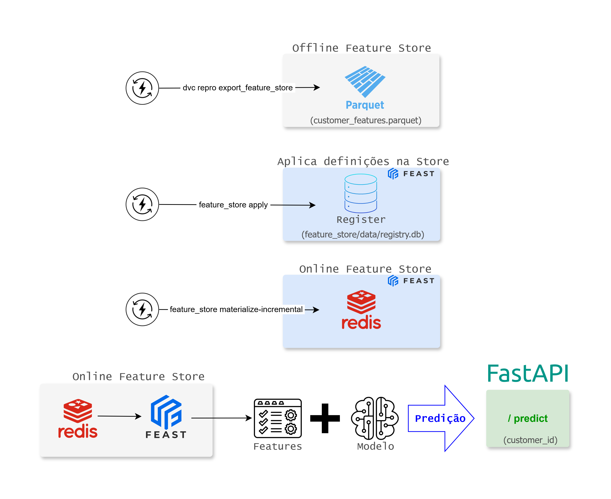

# Feature Store com Feast e Redis

## Índice

- [Objetivo no contexto do projeto](#objetivo-no-contexto-do-projeto)
- [Por que esta abordagem foi escolhida](#por-que-esta-abordagem-foi-escolhida)
- [Offline store x Online store](#offline-store-x-online-store)
- [Features expostas na Feature Store](#features-expostas-na-feature-store)
- [Feature Services por versão de modelo](#feature-services-por-versão-de-modelo)
- [Materialização incremental](#materialização-incremental)
- [O que `apply` e `materialize` fazem](#o-que-apply-e-materialize-fazem)
- [Quando a online store é atualizada](#quando-a-online-store-é-atualizada)
- [Relação entre offline e online no projeto](#relação-entre-offline-e-online-no-projeto)
- [Fluxo local recomendado](#fluxo-local-recomendado)
- [Fluxo operacional recomendado](#fluxo-operacional-recomendado)
- [Desenho lógico](#desenho-lógico)
- [Integração com a narrativa MLOps](#integração-com-a-narrativa-mlops)
- [Limitações assumidas](#limitações-assumidas)
- [Próximos passos naturais](#próximos-passos-naturais)

## Objetivo no contexto do projeto

Este documento descreve a Feature Store do projeto de churn bancário sem
reescrever o pipeline existente.

As decisões arquiteturais e a lacuna residual de maturidade dessa trilha ficam
concentradas em [ADRs/ADR-012.md](ADRs/ADR-012.md). Aqui o foco é explicar
como a Feature Store opera no repositório atual.

No desenho da solução:

- o pipeline principal gera os datasets de treino em `data/processed/`
- uma camada-ponte exporta as features prontas para `data/feature_store/customer_features.parquet`
- o Feast usa esse parquet como offline source
- o Redis, em container, funciona como online store para serving de baixa latência
- `FeatureServices` versionados por modelo explicitam o contrato de consumo

Visão arquitetural resumida:



## Por que esta abordagem foi escolhida

O projeto usa um pipeline de feature engineering centralizado e persistido em `artifacts/models/feature_pipeline.joblib`. Em vez de duplicar regras em um segundo fluxo, a integração com o Feast reaproveita esse pipeline para produzir um dataset offline compatível com feature store.

Isso atende a dois objetivos importantes do Datathon:

- evita duplicidade de lógica de transformação
- mantém coerência entre treino e serving

## Offline store x Online store

### Offline store

No contexto deste projeto, a camada offline da Feature Store é o parquet gerado em `data/feature_store/customer_features.parquet`.

Esse dataset contém:

- `customer_id` como chave da entidade
- `event_timestamp` e `created_timestamp`
- as features transformadas e alinhadas com o modelo champion

O Feast usa essa fonte para registrar as definições e materializar dados para a camada online.

### Online store

A camada online é o Redis local, executado via `docker compose`.

O Redis armazena apenas o estado mais recente das features materializadas. Isso é suficiente para a demo de serving online e reforça a narrativa de produção: treino e histórico ficam na camada offline; leitura de baixa latência fica na camada online.

## Features expostas na Feature Store

As features publicadas na Feature Store são as usadas pelo modelo champion:

- `CreditScore`
- `Age`
- `Tenure`
- `Balance`
- `NumOfProducts`
- `HasCrCard`
- `IsActiveMember`
- `EstimatedSalary`
- `Point Earned`
- `BalancePerProduct`
- `PointsPerSalary`
- `Geo_Germany`
- `Geo_Spain`
- `Gender`
- `Card Type`

Justificativa:

- são as features consumidas pelo modelo
- passam pelo pipeline oficial de transformação
- evitam expor na online store colunas que não entram na inferência, como target, leakage e identificadores diretos

Observação importante:

- `Gender` e `Card Type` ficam armazenadas em formato numérico porque o pipeline aplica `OrdinalEncoder`
- `Geo_Germany` e `Geo_Spain` representam a versão one-hot de `Geography`

Ou seja, a Feature Store publica um conjunto de atributos pronto para inferência, e não a cópia literal das colunas brutas.

## Feature Services por versão de modelo

Para reforçar governança e rastreabilidade, o projeto declara `FeatureServices` específicos por versão de modelo, mesmo reaproveitando a mesma `FeatureView` base.

Exemplos:

- `customer_churn_rf_v1`
- `customer_churn_rf_v2`
- `customer_churn_rf_v3`
- `customer_churn_gb_v1`
- `customer_churn_xgb_v1`

- a `FeatureView` é `customer_churn_features`
- o `FeatureService` define qual contrato de features cada modelo consome
- a configuração de treino aponta explicitamente para esse contrato em `feast.feature_service_name`
- o serving resolve a leitura online pelo `FeatureService` do modelo ativo

Nota importante sobre o endpoint `POST /train`:

- ele pode treinar um novo candidato com outro `feature_service_name`
- ele não troca automaticamente o modelo champion ativo do serving
- ele também não executa `apply` ou `materialize` no Feast
- portanto, um candidato treinado via API só passa a afetar `/predict` após promoção explícita e atualização operacional da Feature Store, quando necessário

Isso aproxima a solução de um cenário produtivo sem introduzir complexidade desnecessária.

## Materialização incremental

O fluxo foi preparado para usar a materialização incremental nativa do Feast. Isso evita o anti-padrão de limpar toda a store online e recarregar tudo do zero.

No dataset acadêmico de churn não existe um timestamp operacional real. Por isso, a camada-ponte cria um `event_timestamp` determinístico e estável, apenas para permitir:

- uso correto do Feast
- materialização incremental
- demonstração arquitetural coerente em ambiente local

Essa adaptação não pretende simular um CDC real de produção.

## O que `apply` e `materialize` fazem

Embora apareçam juntos no uso cotidiano, `apply` e `materialize` cumprem papéis diferentes:

- `feast apply` atualiza o catálogo da Feature Store
- `feast materialize-incremental` publica dados da camada offline na camada online

- `apply` lê `feature_store/repo.py` e registra `Entity`, `FeatureView` e `FeatureServices`
- `materialize-incremental` lê o parquet offline exportado e envia para o Redis apenas a janela incremental pendente

Isso significa que:

- alterar definições da store exige `apply`
- atualizar os dados disponíveis para o serving exige `materialize`
- chamar `/predict` não executa nenhum desses passos automaticamente

## Quando a online store é atualizada

O Redis não observa o parquet offline sozinho. A atualização da camada online ocorre apenas quando a materialização é disparada manualmente.

- `dvc repro` reconstrói artefatos offline do pipeline
- `feast materialize-incremental` sincroniza esses dados com a online store
- `/predict` consulta apenas o que estiver materializado

Essa separação foi mantida de propósito para deixar explícita a diferença entre:

- pipeline reprodutível de dados
- operação online da Feature Store

## Relação entre offline e online no projeto

No desenho da solução, a camada offline é a fonte publicada de referência da Feature Store. O Redis funciona como projeção operacional dessa base para serving de baixa latência.

Portanto:

- a offline store guarda a publicação completa preparada para o Feast
- a online store guarda apenas o estado necessário para leitura rápida
- treino e histórico ficam mais próximos da camada offline
- inferência online consulta a camada materializada no Redis

Esse desenho resolve o principal gap arquitetural do projeto: evitar uma online store destrutiva baseada em limpeza total e recarga integral.

## Fluxo local recomendado

### 1. Instalar dependências

```bash
poetry install --all-extras
```

### 2. Subir o Redis

```bash
docker compose up -d redis
```

### 3. Gerar features e modelo do pipeline principal

```bash
poetry run dvc repro featurize
poetry run dvc repro train
```

### 4. Exportar a camada offline do Feast

```bash
poetry run dvc repro create_fs_offline
```

### 5. Aplicar as definições do Feast

```bash
poetry run feast -c feature_store apply
```

### 6. Materializar para o Redis

```bash
poetry run feast -c feature_store materialize-incremental $(date -u +"%Y-%m-%dT%H:%M:%S")
```

Esse comando não faz `full flush` do Redis. Ele usa a janela incremental mantida pelo Feast para publicar apenas o que precisa ser atualizado.

## Fluxo operacional recomendado

O fluxo mais seguro para preparar a Feature Store e
depois usar o serving e:

```bash
poetry run dvc repro create_fs_offline
poetry run task feastapply
poetry run task feastmaterialize
docker compose up -d serving prometheus grafana
```

Em termos de responsabilidade:

- `dvc repro create_fs_offline` prepara a camada offline
- `feast apply` registra ou atualiza o catalogo do Feast
- `feast materialize-incremental` publica as features na online store Redis
- o `serving` apenas consulta a online store; ele nao deve bootstrapar o Feast em runtime

O `dvc repro` nao substitui:

- a criacao/atualizacao do registry do Feast
- a materializacao da online store

## Desenho lógico

```text
Dados + pipeline de features
        |
        v
python -m src.feast_ops.export
ou dvc repro create_fs_offline
        |
        v
data/feature_store/customer_features.parquet
        |
        v
feast -c feature_store apply
        |
        v
feature_store/data/registry.db
        |
        v
feast -c feature_store materialize-incremental ...
        |
        v
Redis online store
        |
        v
POST /predict -> serving -> Feast -> Redis -> features -> modelo -> resposta
```

Nesse desenho:

- a camada batch prepara e publica
- a camada online apenas serve
- o serving nao precisa escrever no repositorio do Feast para responder
- o fluxo evita acoplar bootstrap de infraestrutura com inferencia online

### 7. Ler features online por `customer_id`

```bash
poetry run python -m src.feast_ops.demo --customer-id 15634602
```

## Integração com a narrativa MLOps

Esta evolução se conecta ao restante da plataforma desta forma:

- `DVC`: rastreia o artefato offline exportado da feature store como parte do pipeline local
- `MLflow`: é o tracking de experimentos e lineage de treino; o nome do `FeatureService` passa a ser registrado como parte do contrato do modelo
- `Feature engineering`: segue centralizado no pipeline existente, sem reimplementação paralela
- `Serving`: consulta a online store usando o `FeatureService` compatível com o modelo ativo
- `Docker Compose`: ganha um Redis local simples, suficiente para demonstração

## Limitações assumidas

- o dataset de churn é estático, então o `event_timestamp` é sintético
- o fluxo demonstra batch-to-online materialization, não streaming
- não há autenticação nem TLS no Redis local, por escolha deliberada de simplicidade
- os `FeatureServices` reaproveitam a mesma `FeatureView`, porque a ênfase está em governança e versionamento do contrato, não em divergência real de features
- a atualização da online store é manual; não há scheduler dedicado para `materialize`

## Próximos passos naturais

- evoluir `FeatureServices` para refletir conjuntos de features realmente distintos entre modelos
- substituir timestamp sintético por data operacional real, caso o dataset evolua
- adicionar testes de integração específicos para `apply`, materialização e leitura online
